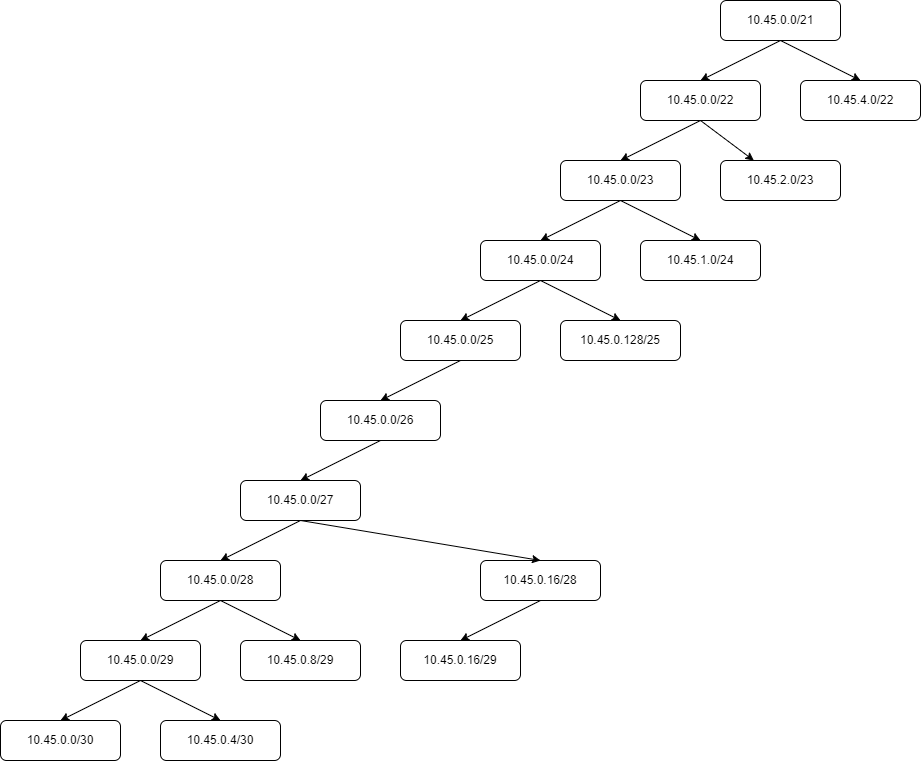
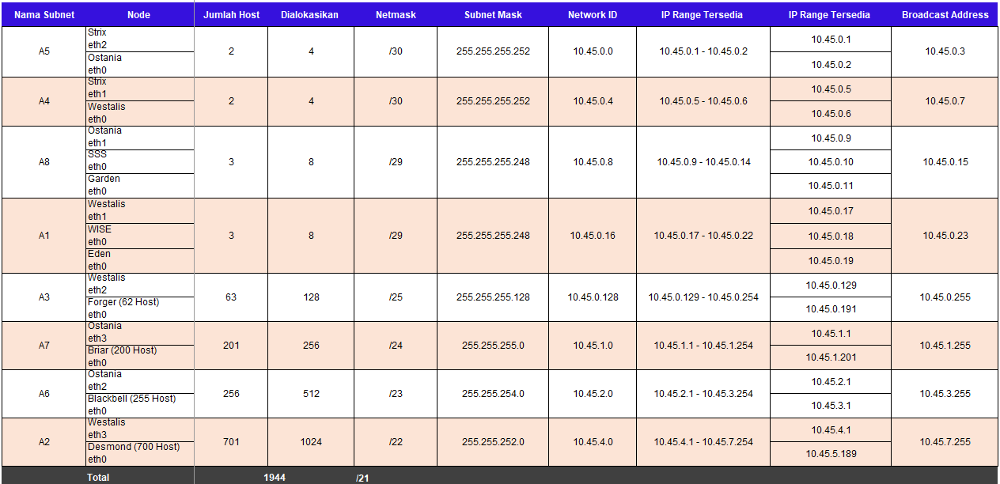
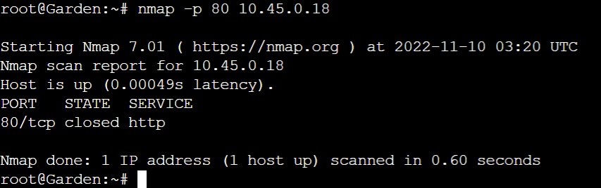
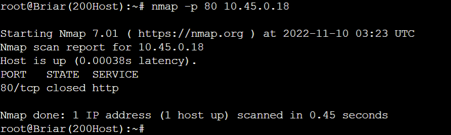
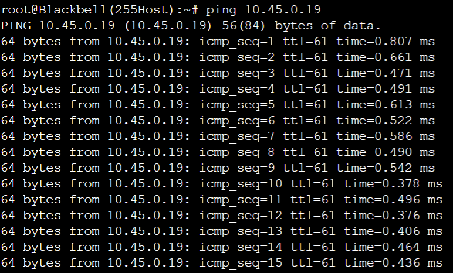
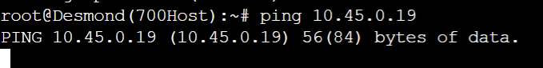
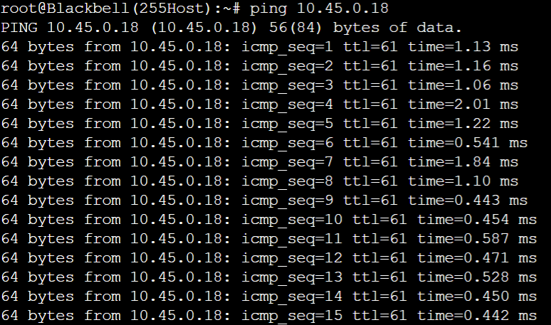
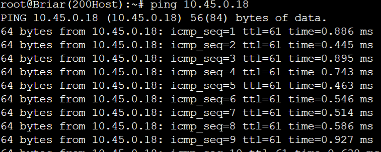
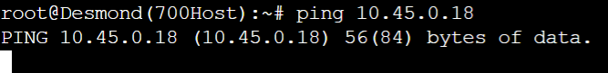

# :zap: **Jarkom-Modul-5-ITB01-2022** :zap:

| Nama                               | NRP            |
|------------------------------------|----------------|
| 	:adult: Rafael Nixon              | 05311940000025 |
| 	:adult: Fairuz Azka Maulana       | 5027201017     |
| 	:adult: Muhammad Firdho Kustiawan | 5027201005     | 
<br/>

# :large_blue_circle: **VLSM** :large_blue_circle: 

### :triangular_flag_on_post: **Pembagian Subnet VLSM** 


<br>

### :triangular_flag_on_post: **Tree VLSM**  


<br>

### :triangular_flag_on_post: **Pembagian IP VLSM** 


<br>

# :large_blue_circle: **Konfigurasi Network Setiap Node** :large_blue_circle: 

### :rocket: **Router Strix** 
```JavaScript
auto eth0
iface eth0 inet dhcp

auto eth1
iface eth1 inet static
	address 10.45.0.5
	netmask 255.255.255.252

auto eth2
iface eth2 inet static
	address 10.45.0.1
	netmask 255.255.255.252
```
<br>

### :rocket: **Router Westalis** 
```JavaScript
auto eth0
iface eth0 inet static
	address 10.45.0.6
	netmask 255.255.255.252

auto eth1
iface eth1 inet static
	address 10.45.0.17
	netmask 255.255.255.248

auto eth2
iface eth2 inet static
	address 10.45.0.129
	netmask 255.255.255.128

auto eth3
iface eth3 inet static
	address 10.45.4.1
	netmask 255.255.252.0
```
<br>

### :rocket: **Router Ostania** 
```JavaScript
auto eth0
iface eth0 inet static
	address 10.45.0.2
	netmask 255.255.255.252

auto eth1
iface eth1 inet static
	address 10.45.0.9
	netmask 255.255.255.248

auto eth2
iface eth2 inet static
	address 10.45.2.1
	netmask 255.255.254.0

auto eth3
iface eth3 inet static
	address 10.45.1.1
	netmask 255.255.255.0
```
<br>

### :rocket: **Client Forger, Desmond, Blackbell, dan Briar** 
```JavaScript
auto eth0
iface eth0 inet dhcp
```
<br>

### :rocket: **Server Eden** 
```JavaScript
auto eth0
iface eth0 inet static
		address 10.45.0.19
		netmask 255.255.255.248
        gateway 10.45.0.17
```
<br>

### :rocket: **Server WISE** 
```JavaScript
auto eth0
iface eth0 inet static
		address 10.45.0.18
		netmask 255.255.255.248
        gateway 10.45.0.17
```
<br>

### :rocket: **Server Garden** 
```JavaScript
auto eth0
iface eth0 inet static
		address 10.45.0.11
		netmask 255.255.255.248
        gateway 10.45.0.9
```
<br>

### :rocket: **Server SSS** 
```JavaScript
auto eth0
iface eth0 inet static
		address 10.45.0.11
		netmask 255.255.255.248
        gateway 10.45.0.9
```
<br>

# :large_blue_circle: **Routing dan Konfigurasi DNS, Web Server, DHCP Server, dan DHCP Relay** :large_blue_circle: 

### :rocket: **Router Strix** 
```JavaScript
route add -net 10.45.4.0 netmask 255.255.252.0 gw 10.45.0.6 #A2_Desmond
route add -net 10.45.0.128 netmask 255.255.252.128 gw 10.45.0.6 #A3_Forger
route add -net 10.45.0.16 netmask 255.255.255.248 gw 10.45.0.6 #A1_WISEEden

route add -net 10.45.2.0 netmask 255.255.254.0 gw 10.45.0.2 #A6_Blackbell
route add -net 10.45.1.0 netmask 255.255.255.0 gw 10.45.0.2 #A7_Briar
route add -net 10.45.0.8 netmask 255.255.255.248 gw 10.45.0.2 #A8_GardenSSS
```
<br>

### :rocket: **Router Westalis** 
```JavaScript
route add -net 0.0.0.0 netmask 0.0.0.0 gw 10.45.0.5
```
<br>

### :rocket: **Router Ostania** 
```JavaScript
route add -net 0.0.0.0 netmask 0.0.0.0 gw 10.45.0.1
```
<br>

### :rocket: **Server Eden - DNS Server** 
Konfigurasi pada file ` /etc/bind/named.conf.options`
```JavaScript
apt update
apt install bind9 -y

options {
        directory "/var/cache/bind";
        forwarders {
                192.168.122.1;
        };
        allow-query { any; };
        auth-nxdomain no;    # conform to RFC1035
        listen-on-v6 { any; };
}; >

service bind9 restart
```
<br>

### :rocket: **Server WISE - DHCP Server** 
1. Konfigurasi pada file `/etc/default/isc-dhcp-server`
    ```JavaScript
    apt update
    apt install isc-dhcp-server -y

    INTERFACES="eth0"
    ```
2. Konfigurasi pada file `/etc/dhcp/dhcpd.conf`
    ```JavaScript

    ddns-update-style none;
    option domain-name "example.org";
    option domain-name-servers ns1.example.org, ns2.example.org;
    default-lease-time 600;
    max-lease-time 7200;
    log-facility local7;

    #A2
    subnet 10.45.4.0 netmask 255.255.252.0 {
        range 10.45.4.2 10.45.7.254;
        option routers 10.45.4.1;
        option broadcast-address 10.45.7.255;
        option domain-name-servers 10.45.0.19;
        default-lease-time 360;
        max-lease-time 7200;
    }

    #A6
    subnet 10.45.2.0 netmask 255.255.254.0 {
        range 10.45.2.2 10.45.3.254;
        option routers 10.45.2.1;
        option broadcast-address 10.45.3.255;
        option domain-name-servers 10.45.0.19;
        default-lease-time 720;
        max-lease-time 7200;
    }

    #A7
    subnet 10.45.1.0 netmask 255.255.255.0 {
        range 10.45.1.2 10.45.1.254;
        option routers 10.45.1.1;
        option broadcast-address 10.45.1.255;
        option domain-name-servers 10.45.0.19;
        default-lease-time 720;
        max-lease-time 7200;
    }

    #A3
    subnet 10.45.0.128 netmask 255.255.255.128 {
        range 10.45.0.130 10.45.0.254;
        option routers 10.45.0.129;
        option broadcast-address 10.45.0.255;
        option domain-name-servers 10.45.0.19;
        default-lease-time 720;
        max-lease-time 7200;
    }

    #A5
    subnet 10.45.0.0 netmask 255.255.255.252 {}

    #A4
    subnet 10.45.0.4 netmask 255.255.255.252 {}

    #A8
    subnet 10.45.0.8 netmask 255.255.255.248 {}

    #A1
    subnet 10.45.0.16 netmask 255.255.255.248 {}
    ```
3. Restart
    ```JavaScript
    service isc-dhcp-server restart
    ```
<br>

### :rocket: **Server Eden - DNS Server** 
Konfigurasi pada file ` /etc/bind/named.conf.options`
```JavaScript
apt update
apt install bind9 -y

options {
        directory "/var/cache/bind";
        forwarders {
                192.168.122.1;
        };
        allow-query { any; };
        auth-nxdomain no;    # conform to RFC1035
        listen-on-v6 { any; };
}; >

service bind9 restart
```
<br>

### :rocket: **Router Strix - DHCP Relay** 
Konfigurasi pada file `/etc/default/isc-dhcp-relay`
```JavaScript
apt update
apt install isc-dhcp-relay -y

SERVERS="10.45.0.18" #WISE
INTERFACES="eth2 eth1"
OPTIONS=""

service isc-dhcp-relay restart
```
<br>

### :rocket: **Router Ostania - DHCP Relay** 
Konfigurasi pada file `/etc/default/isc-dhcp-relay`
```JavaScript
apt update
apt install isc-dhcp-relay -y

SERVERS="10.45.0.18" #WISE
INTERFACES="eth2 eth3 eth1 eth0"
OPTIONS=""

service isc-dhcp-relay restart
```
<br>

### :rocket: **Router Westalis - DHCP Relay** 
Konfigurasi pada file `/etc/default/isc-dhcp-relay`
```JavaScript
apt update
apt install isc-dhcp-relay -y

SERVERS="10.45.0.18" #WISE
INTERFACES="eth2 eth3 eth0 eth1"
OPTIONS=""

service isc-dhcp-relay restart
```
<br>

### :rocket: **Server Garden dan SSS - Web Server** 
Konfigurasi pada file `/etc/default/isc-dhcp-relay`
```JavaScript
apt update
apt install apache2 -y
service apache2 start
echo "$HOSTNAME" > /var/www/html/index.html
```
<br>

# :large_blue_circle: **Soal 1** :large_blue_circle: 
Agar topologi yang kalian buat dapat mengakses keluar, kalian diminta untuk mengkonfigurasi Strix menggunakan iptables, tetapi Loid tidak ingin menggunakan MASQUERADE.

### :triangular_flag_on_post: **Jawaban:**

### :rocket: **Router Strix** 
```JavaScript
IPETH0="$(ip -br a | grep eth0 | awk '{print $NF}' | cut -d'/' -f1)"
iptables -t nat -A POSTROUTING -o eth0 -j SNAT --to-source "$IPETH0" -s 10.45.0.0/21
```
<br>

# :large_blue_circle: **Soal 2** :large_blue_circle: 
Kalian diminta untuk melakukan drop semua TCP dan UDP dari luar Topologi kalian pada server yang merupakan DHCP Server demi menjaga keamanan.

### :triangular_flag_on_post: **Jawaban:**

### :rocket: **Router Strix** 
```JavaScript
iptables -A FORWARD -d 10.45.0.18 -i eth0 -p tcp --dport 80 -j DROP #WISE
iptables -A FORWARD -d 10.45.0.18 -i eth0 -p udp --dport 53 -j DROP 
```
### :triangular_flag_on_post: **Testing di Server Garden - Web Server**  


### :triangular_flag_on_post: **Testing di Server SSS - Web Server**  


### :triangular_flag_on_post: **Testing di Client Briar**  

<br>
<br>

# :large_blue_circle: **Soal 3** :large_blue_circle: 
Loid meminta kalian untuk membatasi DHCP dan DNS Server hanya boleh menerima maksimal 2 koneksi ICMP secara bersamaan menggunakan iptables, selebihnya didrop yang artinya hanya menerima koneksi 2 host selebihnya maka didrop

### :triangular_flag_on_post: **Jawaban:**
pada WISE masukan iptables
```
iptables -A INPUT -p icmp -m connlimit --connlimit-above 2 --connlimit-mask 0 -j DROP
```
kemudian melakukan testibg dengan melakukan ping pada Blackbell(Host 1), Briar(Host 2), dan Desmond(Host 3)
Blackbell(Host 1)

Briar(Host 2)

Desmond(Host 3)

kemudian masukan ip tables pada Eden 
```
iptables -A INPUT -p icmp -m connlimit --connlimit-above 2 --connlimit-mask 0 -j DROP
```
kemudian melakukan testibg dengan melakukan ping pada Blackbell(Host 1), Briar(Host 2), Desmond(Host 3)
Blackbell(Host 1)

Briar(Host 2)

Desmond(Host 3)


# :large_blue_circle: **Soal 4** :large_blue_circle: 
Akses menuju Web Server hanya diperbolehkan disaat jam kerja yaitu Senin sampai Jumat pada pukul 07.00 - 16.00.

### :triangular_flag_on_post: **Jawaban:**
pada soal ini kami melakukan konfigurasi pada Garden dan SSS untuk mengatur waktu Reject, dengan command

```
#Garden
iptables -A INPUT -s 10.45.0.8/29 -m time --weekdays Sat,Sun -j REJECT
iptables -A INPUT -s 10.45.0.8/29 -m time --timestart 00:00 --timestop 06:59 --weekdays Mon,Tue,Wed,Thu,Fri -j REJECT
iptables -A INPUT -s 10.45.0.8/29 -m time --timestart 16:01 --timestop 23:59 --weekdays Mon,Tue,Wed,Thu,Fri -j REJECT
```
Kemudian lakukan testing pada Briar(Host 2)
manggunakan ping 10.45.0.8

dan menggunakan ping 10.45.0.8


# :large_blue_circle: **Soal 5** :large_blue_circle: 
Karena kita memiliki 2 Web Server, Loid ingin Ostania diatur sehingga setiap request dari client yang mengakses Garden dengan port 80 akan didistribusikan secara bergantian pada SSS dan Garden secara berurutan dan request dari client yang mengakses SSS dengan port 443 akan didistribusikan secara bergantian pada Garden dan SSS secara berurutan.

### :triangular_flag_on_post: **Jawaban:**

# :large_blue_circle: **Soal 6** :large_blue_circle: 
Karena Loid ingin tau paket apa saja yang di-drop, maka di setiap node server dan router ditambahkan logging paket yang di-drop dengan standard syslog level.


### :triangular_flag_on_post: **Jawaban:**
